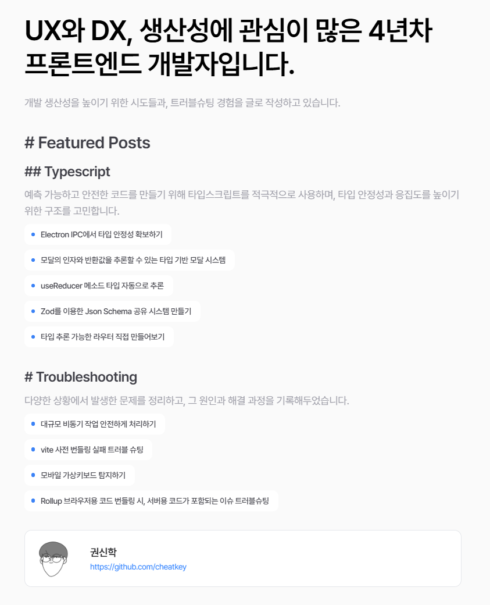

# Frontend Atelier

A personal blog project documenting tips, debugging notes, and troubleshooting logs encountered during frontend development.

## Overview

This project serves as a knowledge base for issues, patterns, and insights gained while working on frontend technologies. It is intended both as a reference for personal use and as public documentation for other developers facing similar problems.

## Tech Stack

- **Framework**: [Next.js](https://nextjs.org/)
- **Documentation Theme**: [Nextra](https://nextra.site/)
- **Deployment**: [Vercel](https://vercel.com/)

The site is built as a static site using Next.js with Nextra, allowing for fast, SEO-friendly documentation pages with Markdown support.

